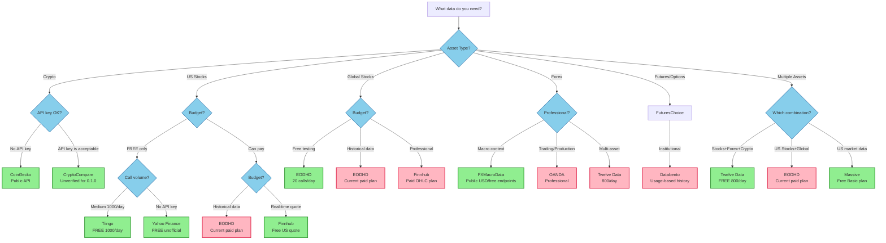

# Provider Selection Guide

Choose the right data provider for your needs with this decision flowchart.

CryptoCompare is included for evaluation but is not release-qualified for 0.1.0. Account
registration was unavailable during release validation, so no live contract evidence was obtained.

## Quick Decision Flowchart

## Provider Comparison Matrix

### By Asset Class

| Provider | Crypto | US Stocks | Global Stocks | Forex | Futures | API Key | Free Tier | Best For |
|----------|--------|-----------|---------------|-------|---------|---------|-----------|----------|
| **CoinGecko** | ✅ | ❌ | ❌ | ❌ | ❌ | No | Unlimited | Crypto historical |
| **CryptoCompare** | ✅ | ❌ | ❌ | ❌ | ❌ | Yes | Unverified | Evaluation only |
| **Tiingo** | ✅ | ✅ | ❌ | ❌ | ❌ | Yes | 1000/day | High-quality stocks |
| **EODHD** | ❌ | ✅ | ✅ | ❌ | ❌ | Yes | 20 calls/day, one-year history | Global stocks |
| **Finnhub** | ✅ | ✅ | ✅ | ✅ | ❌ | Yes | US quotes; OHLC is paid | Quotes and company data |
| **Twelve Data** | ✅ | ✅ | ❌ | ✅ | ❌ | Yes | 800/day | Multi-asset + indicators |
| **OANDA** | ❌ | ❌ | ❌ | ✅ | ❌ | Yes | Practice account | Professional forex |
| **Databento** | ❌ | ✅ | ❌ | ❌ | ✅ | Yes | Free metadata; metered history | Institutional futures |
| **Massive** | ✅ | ✅ | ❌ | ✅ | ✅ | Yes | Free Basic plan | Multi-asset market data |

### By Pricing

#### Free Tier (No Credit Card Required)

| Provider | Daily Limit | Monthly Limit | Best Use Case |
|----------|-------------|---------------|---------------|
| **CoinGecko** | Current public API limit | Current public API limit | Crypto research |
| **Tiingo** | 1000 calls | 500 symbols | Daily stock updates |
| **EODHD** | 20 calls | Account limit | Global stock testing |
| **Twelve Data** | 800 calls | ~24K calls | Multi-asset research |
| **Massive Stocks Basic** | 5 calls/minute | Account limit | US aggregate data |

#### Paid Tiers (Affordable)

| Provider | Price | What You Get |
|----------|-------|--------------|
| **EODHD** | See current pricing | Expanded global coverage and history |
| **Twelve Data** | See current pricing | Higher API credits and market coverage |
| **Tiingo** | $30/mo | 20K calls/hour, news, fundamentals |

#### Professional Tiers

| Provider | Starting Price | What You Get |
|----------|----------------|--------------|
| **Finnhub** | See current pricing | Historical OHLC and additional datasets |
| **Massive** | See current pricing | Longer history, trades, quotes, and real-time data |
| **Databento** | Usage-based or subscription | Institutional futures and OPRA options |

## Decision Guidelines

### For Beginners
1. **Start with CoinGecko** (crypto) - No API key, unlimited free tier
2. **Try Tiingo** (stocks) - Generous free tier (1000/day), great quality
3. **Check access terms** - Coverage and permitted use differ by account

### For Researchers
1. **Tiingo** - High-quality stock data with generous limits
2. **EODHD** - Global coverage with a small free evaluation allowance
3. **Twelve Data** - Multi-asset research with a usable free tier

### For Traders
1. **EODHD** - Global end-of-day stocks
2. **OANDA** - Professional forex data
3. **Finnhub** - Free US quotes; paid historical OHLC

### For Institutions
1. **Databento** - Tick-level futures data
2. **Massive** - Multi-asset professional data
3. **Finnhub** - Global exchange coverage

## Quick Recommendations

### "I want crypto data"
→ **CoinGecko** (no API key, subject to public API limits)

### "I want US stock data for free"
→ **Tiingo** (1000/day) or **Yahoo Finance** (no API key, unofficial)

### "I want global stock data"
→ **EODHD** or **Twelve Data**, depending on the required market and history

### "I want stocks + forex + crypto"
→ **Twelve Data** (800/day free)

### "I'm building a trading system"
→ Choose by required endpoint, latency, history, and licensing terms

### "I need professional derivatives data"
→ **Databento** (free discovery and cost estimates; metered time-series data)

## Rate Limit Considerations

### Conservative (Good for testing)
- **EODHD Free**: 20 calls/day
- **Twelve Data Free**: 800/day

### Moderate (Good for research)
- **Tiingo**: 1000/day
- **CoinGecko**: 10-50/min

### High Volume (Good for production)
- **EODHD Paid**: Unlimited
- **Finnhub**: 60/min (free), higher (paid)
- **Tiingo Paid**: 20K/hour

## Next Steps

1. **Read the full provider docs** in the [provider reference](../providers/index.md)
2. **Check provider status** in your target asset class
3. **Get API keys** from provider websites
4. **Test with free tiers** before committing to paid plans
5. **Use incremental updates** to minimize API calls

## Getting Help

- **Documentation**: See the [user guide](../user-guide/index.md)
- **Examples**: Check the [example programs](https://github.com/ml4t/data/tree/main/examples)
- **Issues**: Report problems on GitHub
- **Community**: Join discussions for provider recommendations
